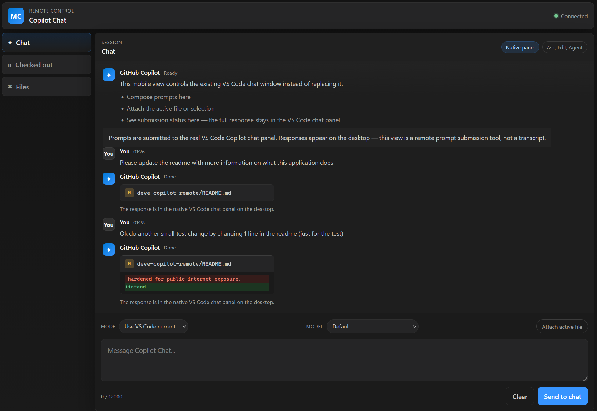
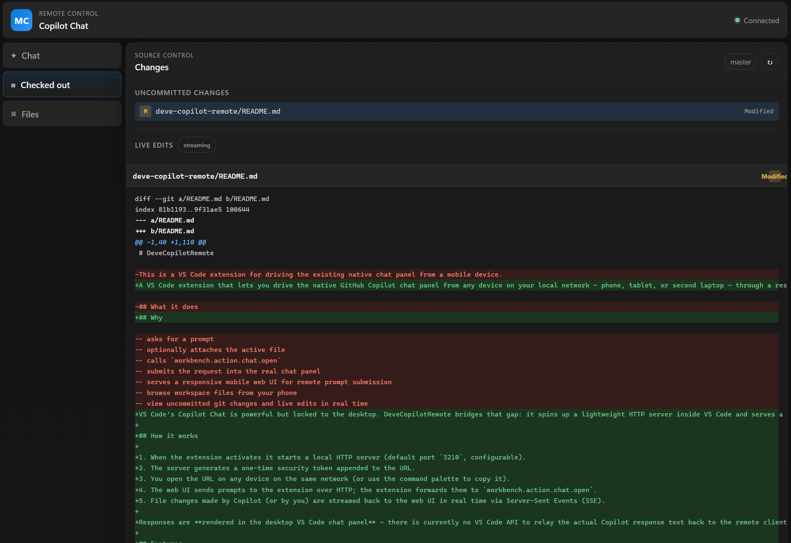
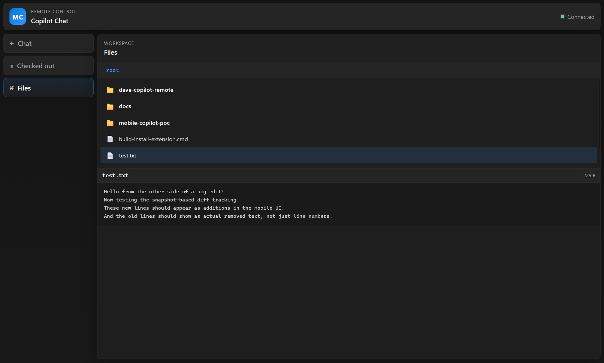

# DeveCopilotRemote

> **Shopping for clothes with your wife?** She's trying on outfit #47, you're on commit #47.
> 
> **At the gym between sets?** Lift, rest, bugfix, repeat.
> 
> **Sitting in church?** Let us deploy. Amen.
> 
> **Dropping a big one?** Time on the throne, code on the phone.
> 
> **Funeral?** Okay maybe not this one. ...Unless the WiFi's good.

Drive the VS Code Copilot chat panel from your phone.

This extension starts a local web server so you can submit prompts, browse files, and watch live changes from any device on the same network.

(So yeah, if you're outside of the house, just run a VPN / Tailscale / whatever, copilot will fix this for you)

## Screenshots

### Chat

### Checked-out changes

### Files

## Commands

- `DeveCopilotRemote: Send Prompt To Chat`
- `DeveCopilotRemote: Summarize Active File In Chat`
- `DeveCopilotRemote: Open Web UI`
- `DeveCopilotRemote: Copy Web UI URL`

## Run locally

1. `npm install`
2. `npm run compile`
3. Open in VS Code and press **F5**.
4. Run `DeveCopilotRemote: Copy Web UI URL` and open the URL on your phone.

## Limitations

When Copilot requests a tool confirmation (e.g. running a terminal command), the response cannot be extracted — you will need to approve it on the desktop VS Code chat panel. Simple ask-mode responses are relayed directly to the mobile web UI. I would suggest to just activate the "Autopilot mode".
